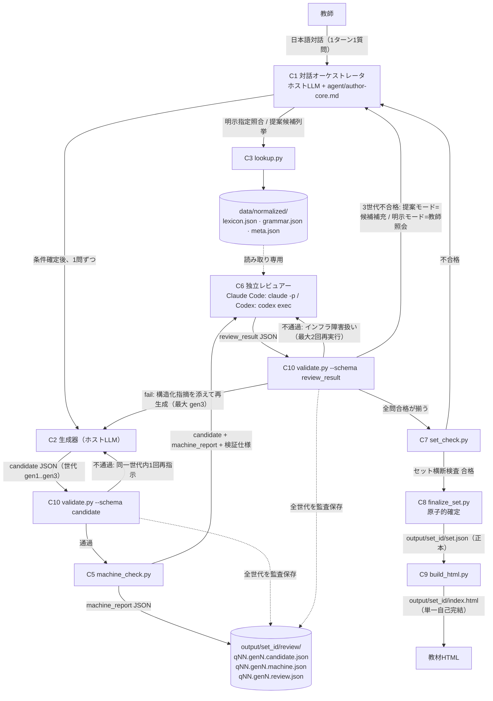

# docs/architecture.md — システムアーキテクチャ仕様

| 項目 | 内容 |
|---|---|
| 目的 | CEFR-J準拠作問エージェントの全体構造（コンポーネント・データフロー・リポジトリ構成・CLI契約・エラーコード目録・バージョン管理・運用手順）を、実装者（Codex GPT-5.6 sol）が追加判断なしで実装できる粒度で定める。 |
| 対象読者 | 実装者（Codex）、レビュー担当者、設計文書の他執筆者。 |
| 参照文書 | `docs/requirements.md`（要件・スコープ外/v2リストの正）、`docs/interaction-flow.md`、`docs/question-generation-spec.md`、`docs/cefrj-validation-spec.md`、`docs/subagent-review-spec.md`、`docs/json-output-spec.md`、`docs/html-output-spec.md`、`docs/cross-agent-compatibility.md`、`docs/testing-and-acceptance.md`、`DECISIONS.md`、`IMPLEMENTATION_PLAN.md` |
| 規範語彙凡例 | 「しなければならない(MUST)」=絶対要件。「してはならない(MUST NOT)」=絶対禁止。「すべきである(SHOULD)」=正当な理由がない限り従う。「してもよい(MAY)」=任意。 |
| この文書が「正」とする範囲 | ①コンポーネント分割と責務、②データフロー、③リポジトリ構成、④CLI 9本の入出力契約（引数・stdin/stdout・終了コード）、⑤**エラーコード目録**、⑥バージョン管理（スキーマsemver・`data_version`）、⑦運用手順（原本更新・allowlist追加・リリース・教師の更新・フィクスチャ更新）。検証内容・生成規則・対話文言・スキーマのフィールド定義は本書の正ではなく、各担当文書を参照する。 |

---

## 1. アーキテクチャ原則

- **ARC-01** 問題データの正本はJSON（`output/<set_id>/set.json`）でなければならない(MUST)。HTMLは合格済み `set.json` のみから決定的に生成しなければならない(MUST)。
- **ARC-02** 挙動規則（対話手順・生成制約・フロー状態遷移・検証規則・エラー文言）は、共通コア指示書（`agent/author-core.md`・`agent/reviewer-core.md`）と決定的スクリプト（`scripts/` 配下のPython CLI）に集約しなければならない(MUST)。ツール別アダプタ（Claude Code / Codex）とテストproviderは配線のみとし、挙動規則を書いてはならない(MUST NOT)。配線の詳細は `docs/cross-agent-compatibility.md` を正とする。
- **ARC-03** 決定的に実行できる処理（フロー状態遷移・世代管理・補充・監査文書構築・正規化・機械検査・セット横断検査・スキーマ検証・セット確定・HTML生成・照会・診断）は、すべてPython 3.11+のCLIとして実装しなければならない(MUST)。LLMに委ねてよいのは、対話・問題文生成・機械化不能な適合性判断（独立レビュー）のみである。
- **ARC-04** 機械検査の違反は覆せない自動不合格としなければならない(MUST)。独立LLMレビューは追加の不合格判定のみ行うことができ、機械検査の違反を上書きしてはならない(MUST NOT)。検査項目の分担の正は `docs/cefrj-validation-spec.md` の検証マトリクス。
- **ARC-05** セットアップ完了後の決定的スクリプトとテスト本体は完全オフラインで動作しなければならず(MUST)、ネットワークアクセスをしてはならない(MUST NOT)。例外処理は`python scripts/setup.py`による`requirements.txt`の固定版依存パッケージとspaCyモデル（en_core_web_sm）の取得、およびCI・開発環境でテスト開始前に行う`requirements-dev.txt`の固定pytest取得に限りネットワークアクセスしてもよい(MAY)。テレメトリを実装してはならない(MUST NOT)。
- **ARC-06** 全CLIは実行前に前提条件検査を行い、不成立時は本書第6節の定義済みエラーコードと日本語対処手順を出力して停止しなければならない(MUST)。
- **ARC-07** `set.json` はセット完成時（確定予定の全問題（`final_question_ids`、`docs/json-output-spec.md` FIN-01。減数時は要求数未満でもよい）の合格世代が揃い、セット横断検査に合格し、スキーマ検証を通過した時）のみ書き込まなければならない(MUST)。中断したセットは `output/<set_id>/review/` の監査ファイルのみが残り、`set.json` が存在しないことで未完成と判別できる。処理再開機能は実装してはならない(MUST NOT)（v2課題。`docs/requirements.md` のスコープ外リスト参照）。

## 2. コンポーネントと責務

| # | コンポーネント | 実体 | 責務 | 挙動規則の正 |
|---|---|---|---|---|
| C1 | 対話オーケストレータ | ホストLLM + `agent/author-core.md` | 教師との日本語対話（1ターン1質問）、条件確定、C12 actionに応じた候補生成・独立レビュー境界の実行、教師照会の表示 | `docs/interaction-flow.md` |
| C2 | 生成器 | ホストLLM（C1と同一セッション） | 候補問題（candidate JSON）の生成・再生成 | `docs/question-generation-spec.md` |
| C3 | 照会サービス | `scripts/lookup.py` | 正規化データの検索（明示指定照合・提案候補列挙・誤答プール取得） | 本書第5節（契約）、検索規則は `docs/cefrj-validation-spec.md`・`docs/question-generation-spec.md` |
| C4 | 正規化ビルダー | `scripts/build_normalized.py` | 原本xlsx→`data/normalized/`（lexicon.json / grammar.json / meta.json）の決定的変換 | `docs/cefrj-validation-spec.md` 正規化仕様 |
| C5 | 機械検査器 | `scripts/machine_check.py` | 候補1問の決定的検査（レンマ照合・語数・免除規則・誤答由来照合ほか）と machine_report 出力 | `docs/cefrj-validation-spec.md` 機械検査仕様 |
| C6 | 独立レビュアー | 独立コンテキストのLLM + `agent/reviewer-core.md`（Claude Code=`.claude/run_reviewer.py`監視下の`claude -p`、Codex=`.codex/run_reviewer.py`監視下の`codex exec`） | 機械化不能なCEFR-J適合性判断、review_result 出力 | `docs/subagent-review-spec.md` |
| C7 | セット横断検査器 | `scripts/set_check.py` | 対象重複・例文使い回し・誤答の過度な再利用の決定的検査 | 検査項目は `docs/cefrj-validation-spec.md`、監査ファイルの読み取り位置は `docs/subagent-review-spec.md` |
| C8 | セット確定器 | `scripts/finalize_set.py` | 完成条件の検査と `set.json` の原子的書き込み | `docs/json-output-spec.md`（set.json 内容）、本書 ARC-07（原子性） |
| C9 | HTML生成器 | `scripts/build_html.py`（Python + Jinja2） | `set.json` から単一自己完結HTMLを決定的に生成 | `docs/html-output-spec.md` |
| C10 | スキーマ検証器 | `scripts/validate.py` | 9スキーマ（`schemas/`）に対する文書検証 | `schemas/*.schema.json`、運用は本書第5.8節 |
| C11 | 診断 | `scripts/doctor.py` | 環境・データ・配線の一括診断 | 本書第5.1節 |
| C12 | フロー制御器 | `scripts/flow_control.py` | S80以降の世代・補充・停止状態、監査文書構築、決定的CLI列、教師照会データ、確定集合の一元管理 | `docs/subagent-review-spec.md` 第5〜8節 |

- **ARC-08** 上表の「挙動規則の正」列に挙げた文書以外で当該規則を再定義してはならない(MUST NOT)。本書のCLI契約は入出力の形（引数・stdin/stdout・終了コード・エラーコード）のみを定める。

## 3. データフロー

1セット（形式1つ+レベル1つ+対象複数+問題数、`docs/requirements.md` FR参照）の標準フローを示す。



- **ARC-09** フロー上の分岐規則の正は次のとおりとする(MUST)。対話・照合・教師照会=`docs/interaction-flow.md`。再生成ループ・世代管理・補充・停止条件・インフラ障害の扱い=`docs/subagent-review-spec.md`。candidate スキーマ不通過時の「同一世代内1回再指示→失敗なら世代消費」および review_result スキーマ不通過時の「インフラ障害扱い（不合格に数えず、最大2回再実行→セット中止）」も同文書を正とし、本書は対応するエラーコード（E-CONTRACT-01）のみ定義する。
- **ARC-10** 監査ファイル（`review/<question_id>.<gen>.candidate.json` / `.machine.json` / `.request.json` / `.review.json`）は全世代・全試行について保存しなければならない(MUST)。配置の正は `docs/subagent-review-spec.md`。
- **ARC-11** レビュアー（C6）に渡してよい入力は、候補問題JSON・機械検査レポート・検証仕様・正規化データへの読み取り専用アクセスのみである(MUST)。生成側（C1/C2）の会話履歴をレビュアーから見えるようにしてはならない(MUST NOT)。
- **ARC-11a** C1はS80開始後、C12が返す `generate_candidate` / `run_review` / `teacher_consult` / `completed` / `aborted` actionだけに従わなければならない(MUST)。C1およびテストハーネスが世代停止、補充所属、合否集計、監査文書、教師照会要約、確定集合を再実装してはならない(MUST NOT)。候補生成と独立レビュー実行だけをprovider境界とする。

## 4. リポジトリ構成

```
cefr_j_agents/
├── DECISIONS.md              # 決定記録
├── IMPLEMENTATION_PLAN.md    # 実装計画
├── docs/                     # 設計文書10本（本書を含む）
├── schemas/                  # JSON Schema 9本（draft 2020-12、semver付き）
├── data/
│   ├── source/               # 原本xlsx 2ファイル（実装時に配置。ファイル名は第6節 E-DATA-01 に固定）
│   │                         #   + sources.json（原本の入手URL・ダウンロード日の手動維持ファイル。OPS-01で更新）
│   ├── normalized/           # lexicon.json / grammar.json / meta.json（ビルドしてコミット）
│   └── config/               # limits.json / proper_nouns.json
├── agent/                    # author-core.md / reviewer-core.md（共通コア指示書）
├── scripts/                  # 本書第5節のCLI 9本
├── templates/                # index.html.j2（自己完結HTML用Jinja2テンプレート）
├── tests/                    # pytest + フィクスチャ（docs/testing-and-acceptance.md）
├── .github/workflows/ci.yml  # Python 3.11の決定的pytest CI（M8D-01）
├── output/<set_id>/          # set.json / index.html / review/ / 一時.staging/（実行時生成。コミットしない）
├── .claude/                  # Claude Codeアダプタ（docs/cross-agent-compatibility.md）
├── CLAUDE.md                 # Claude Codeアダプタ（配線のみ）
├── AGENTS.md                 # Codexアダプタ（配線のみ）
├── NOTICE                    # 出典・ライセンス・再配布注意（docs/requirements.md・DECISIONS.md D-22）
├── requirements-dev.txt      # CI・開発専用の固定版pytest依存（M8D-02）
└── CHANGELOG.md              # 変更記録
```

- **ARC-12** `output/` はバージョン管理にコミットしてはならない(MUST NOT)。`data/normalized/` は出典ヘッダー付きでコミットしなければならない(MUST)。
- **ARC-13** 上記の構成要素の追加・改名は `DECISIONS.md` への決定追記を伴わなければならない(MUST)。
- **ARC-14** `output/<set_id>/.staging/flow-state.json`はC12だけが排他的に作成・置換・削除する一時状態であり、C1・C2・C6・アダプタ・テストproviderが内容を編集してはならない(MUST NOT)。完成・中止時は削除し、教師照会中だけ同一セッション継続のため保持してよい(MAY)。クラッシュ後の処理再開へ使用してはならない(MUST NOT)。

## 5. CLI契約

### 5.0 共通規約

- **CLI-01** 全CLIはリポジトリルートをカレントディレクトリとして実行しなければならない(MUST)。各CLIは起動時に `schemas/` と `data/config/` の存在によりカレントディレクトリを確認し、不成立なら E-ENV-04 で停止しなければならない(MUST)。
- **CLI-02** 終了コードは全CLI共通で次のとおりとする(MUST)。
  - `0` = 正常完了。検査系CLI（machine_check.py / set_check.py）は検査を完遂すれば判定が `fail` でも `0` とする（不合格は正常な業務結果であり、判定はstdoutのJSONで表現する）。例外として doctor.py と validate.py は「合格/妥当」のみ `0` とする（ゲート用途のため。各節参照）。
  - `1` = 定義済みエラーによる停止。stderrの最終行に第6節のエラーJSON（CLI-05）を出力する。ただしdoctor.pyの診断failはCLI-11の一括レポートをstdoutへ出力し、stderrへ単一エラーJSONを重複出力しない。
  - `2` = 未定義の内部エラー（バグ）。stderrにスタックトレースを出力してもよい(MAY)。
- **CLI-03** stdoutには結果JSONを1個だけ出力しなければならない(MUST)。進捗・診断ログをstdoutに混ぜてはならない(MUST NOT)（ログはstderrに出力してもよい(MAY)）。
- **CLI-04** CLIが書き出すJSON（stdout・ファイルとも）は正準形とする(MUST): UTF-8・`ensure_ascii=False`・キーを辞書順ソート・インデント2・改行LF・末尾に改行1個。この規則はHTML決定性・正規化ゴールデン・互換テスト（`docs/cross-agent-compatibility.md` CAT-01、`docs/testing-and-acceptance.md`）のバイト一致の前提である。
- **CLI-05** エラーJSONの形は `{"error_code": "<コード>", "message": "<日本語1行要約>", "remedy": "<日本語対処手順>", "detail": <任意のJSON値またはnull>}` としなければならない(MUST)。message・remedy の内容要件は第6節の各コード定義に従う。
- **CLI-06** 全CLIは `--help`（日本語ヘルプ）を実装しなければならない(MUST)。未知の引数・必須引数欠落は E-INPUT-01 で停止する(MUST)。
- **CLI-07** 入力ファイル引数が `-` の場合はstdinのバイト列を読み、実行環境の標準入力エンコーディングに依存せずUTF-8として復号する(MUST)。stdinまたはファイルのJSONがUTF-8でない、パース不能、またはパース後のstring値・object keyのいずれかがstrict UTF-8へ符号化不能な場合は E-INPUT-03 で停止する(MUST)。`machine_check.py` のcandidate JSONに含まれる整数トークンは符号を除く10進4,300桁以下とし、超過はパース不能の E-INPUT-03 とする(MUST)。
- **CLI-08** 各CLIは処理開始前に、当該CLIの前提条件（下表「前提検査」）を検査しなければならない(MUST)。前提検査の共通セット【基本】= Python版（E-ENV-01）・依存パッケージ（E-ENV-02）・カレントディレクトリ（E-ENV-04）。正規化データを読むCLIはさらに【データ】= 原本xlsx存在（E-DATA-01）・原本チェックサム照合（E-DATA-02）・正規化データ存在（E-DATA-03）・スキーマ通過と内部整合（E-DATA-04）・設定ファイル（E-DATA-05）を検査する。原本欠落・チェックサム不一致・正規化データ不整合のいずれかがあれば処理を拒否しなければならない(MUST)。

### 5.1 契約一覧（9本）

| CLI | 目的 | 主な引数 | stdin | stdout（正常時） | 終了コード | 前提検査 |
|---|---|---|---|---|---|---|
| `doctor.py` | 環境・データ・配線の一括診断 | なし | 使わない | 診断レポートJSON（5.2） | 0=全項目pass / 1=failあり / 2=内部エラー | なし（自身が検査そのもの） |
| `build_normalized.py` | 原本xlsx→正規化JSONの決定的ビルド | `--source-dir`(既定 `data/source`) / `--out-dir`(既定 `data/normalized`) / `--diff` / `--dry-run` / `--accept-source-change` | 使わない | ビルドサマリーJSON（5.3） | 0/1/2 | 【基本】+ E-DATA-01・E-DATA-02・E-DATA-06 + spaCy（E-ENV-03）+ 通常ビルド時の出力先書込み（E-ENV-05） |
| `machine_check.py` | 候補1問の決定的機械検査 | `--candidate <path\|- >` / `--set-id <set_id>` / `--generation <gen1\|gen2\|gen3>` / `--expected-format <9形式>` / `--expected-level <対応レベル>` / `--requested-count <1..上限>`（全て必須） | `-` 指定時に candidate JSON | machine_report JSON | 0=検査完遂（verdictは内容） / 1/2 | 【基本】【データ】+ spaCy（E-ENV-03）+ 入力スキーマ（E-CONTRACT-01） |
| `set_check.py` | セット横断の決定的検査 | `--set-dir <path>`（必須。`output/<set_id>`） | 使わない | セット横断machine_report JSON（5.5） | 0=検査完遂 / 1/2 | 【基本】【データ】+ 監査配置（E-CONTRACT-03）+ set_id形式（E-INPUT-05） |
| `finalize_set.py` | 完成条件検査と set.json の原子的書き込み | `--set-dir <path>`（必須） | 開始時 `config_snapshot` を含むセットメタデータJSON（必須。様式の正は `docs/json-output-spec.md`） | 確定サマリーJSON（5.6） | 0/1/2 | 【基本】【データ】+ E-DATA-08 + E-CONTRACT-03/04/05 + E-INPUT-03/05 |
| `build_html.py` | set.json→単一自己完結HTMLの決定的生成 | `--set <path>`（必須。set.json） / `--out <path>`(既定: 入力と同ディレクトリの `index.html`) | 使わない | 生成サマリーJSON（5.7） | 0/1/2 | 【基本】+ 入力スキーマ（E-CONTRACT-01）+ メジャー一致（E-CONTRACT-02） |
| `validate.py` | 9スキーマに対する文書検証・セット状態識別 | 通常モード: `--schema <名>` / `--file <path\|- >`（ともに必須）。状態確認モード: `--set-dir <path>`（通常モードと排他） | `--file -` 指定時に検証対象JSON | 検証結果JSONまたはセット状態JSON（5.8） | 0=妥当または未完成状態識別 / 1=不当（E-CONTRACT-01）または他エラー / 2 | 【基本】+ スキーマファイル存在（E-ENV-04） |
| `lookup.py` | 正規化データ照会 | サブコマンド `lex` / `gp`（5.9） | 使わない | 照会結果JSON（5.9） | 0=完遂（0件でも0） / 1/2 | 【基本】【データ】 |
| `flow_control.py` | S80以降の決定的状態遷移 | `init` / `candidate` / `review-preflight` / `review` / `decide` / `status` と `--set-dir`（5.10） | `--file -`指定時のinit/candidate/review JSON | 次のaction、review-preflight結果、または終端結果JSON（5.10） | 0/1/2 | 【基本】【データ】+ E-DATA-05/07/08 + E-CONTRACT-01/03/04/05 |

以下、各CLIの詳細契約。

### 5.2 doctor.py

- **CLI-10** 診断項目は次の12項目としなければならない(MUST)。各項目は `pass` / `fail` を判定し、fail時は対応エラーコードを添える。要求依存版は `requirements.txt` の完全固定値（初版: spaCy 3.8.15 / openpyxl 3.1.5 / jsonschema 4.26.0 / Jinja2 3.1.6）、spaCyモデル要求版は en_core_web_sm 3.8.0 とする。
  1. Pythonバージョン ≥ 3.11（E-ENV-01）
  2. 依存パッケージのインポート可否（E-ENV-02）
  3. spaCy en_core_web_sm のロード可否（E-ENV-03）
  4. リポジトリ構成（`schemas/`・`data/config/`・`agent/`・`scripts/` の存在、`templates/index.html.j2` の存在・読取り・Jinja2構文妥当性）（E-ENV-04）
  5. `output/` の作成・書き込み可否（E-ENV-05）
  6. 原本xlsx 2ファイルおよび `data/source/sources.json` の存在と構造（`url`・`download_date` の記載）（E-DATA-01。警告扱いにせず fail とする。原本同梱が前提のため）
  7. 原本チェックサムと `data/normalized/meta.json` 記録値の一致（E-DATA-02）
  8. 正規化データ3ファイルの存在（E-DATA-03）
  9. 正規化データのスキーマ通過、`data_version` 内部整合、および現在の `sources.json.version_label` 2値・実行中の正規化パイプライン版との一致（E-DATA-04）
  10. `limits.json`・`proper_nouns.json` の存在とスキーマ通過（E-DATA-05）
  11. `schemas/` 9ファイルの存在とJSON Schema draft 2020-12 としての自己妥当性（E-ENV-04）
  12. レビュアー配線の検出（E-ENV-06）: `.claude/agents/` のレビュアー定義ファイルの存在、**または** `codex` コマンドがPATH上に存在すること。どちらか一方があれば pass とする。両方無ければ fail。
- **CLI-11** stdout: `{"checks": [{"id": "D01".."D12", "name": "<日本語名>", "status": "pass"|"fail", "error_code": <コードまたはnull>, "message": "<日本語>", "remedy": <日本語対処手順またはnull>}], "summary": {"pass": <int>, "fail": <int>}}`。pass項目の`remedy`はnull、fail項目は対応エラーコードの具体的手順とする。fail が1件でもあれば終了コード1とする(MUST)。doctor は fail 項目があっても全12項目を最後まで実行しなければならない(MUST)（一括診断のため途中停止しない）。診断failは本レポートのみを出力し、CLI-05の単一エラーJSONをstderrへ出力しない。

### 5.3 build_normalized.py

- **CLI-12** 変換規則（シート→JSON・列マッピング・ID規則・併記グループ・教員版⊕ITEM LIST結合・EFL傍証・チェックサム記録）の正は `docs/cefrj-validation-spec.md` の正規化仕様である。本CLIはその仕様の決定的実装であり、同一原本から同一出力（CLI-04の正準形でバイト一致）を生成しなければならない(MUST)。
- **CLI-13** `--diff` 指定時は、既存の `data/normalized/` と新ビルド結果の差分（追加・削除・レベル変更のエントリID一覧と件数）をstdoutサマリーJSONの `diff` キーに含めなければならない(MUST)。`diff` は `{"lexicon": <区分>, "grammar": <区分>}`、各`<区分>`は `{"added": {"count": <int>, "ids": [...]}, "removed": 同形, "level_changed": 同形}` とし、ID配列を辞書順とする。語彙は`level`値、文法は`level`ブロック全体の差でlevel_changedを判定する。既存データが無い場合の `--diff` は E-INPUT-02 で停止する(MUST)。`--diff` は原本チェックサム不一致を比較目的に限り許容し、ファイルを書き込んではならない(MUST NOT)。
- **CLI-14** `--dry-run` 指定時はファイルを書き込んではならない(MUST NOT)。既存 `meta.json` と原本チェックサムが異なる通常ビルドは E-DATA-02 で停止する。承認済み原本更新を本ビルドする場合だけ `--accept-source-change` を指定しなければならない(MUST)。同オプション指定時も、チェックサムが変わった各原本の`sources.json.version_label`が既存metaの対応値から変わっていなければE-DATA-02で拒否する。初回ビルド（既存 `meta.json` なし）は同オプションなしで実行してよい(MAY)。`--diff` と `--accept-source-change` の併用は E-INPUT-01 とする。既存metaがNRM-29に不適合でも、固定された2原本の`role`・`file`・64桁SHA-256を安全根拠として取得でき、実原本のSHA-256が一致する場合、通常ビルドは新しい3ファイルを生成して不適合metaを置換しなければならない(MUST)。SHA-256が不一致の場合は従来のE-DATA-02保護を維持し、`--accept-source-change`は安全根拠に加えて旧`version_label`も有効かつ現在値へ更新済みの場合だけ許可する(MUST)。安全根拠を取得できない場合は初回ビルド扱いにしてはならず(MUST NOT)、E-DATA-04でコミット済みmetaの復元を案内する。3ファイルが全て欠落していても、対象metaパスがGit `HEAD`に存在する場合はコミット済みセットの全削除としてE-DATA-04で停止しなければならない(MUST)。Gitを起動できない、リポジトリを判定できない、または`HEAD`が欠落・破損して履歴を安全に照会できない場合はE-ENV-04で停止しなければならない(MUST)。有効なGit `HEAD`を照会でき、対象metaが存在しない空の出力先だけを真の初回ビルドとして許可する(MAY)。`--diff`は既存metaの完全なNRM-29適合を要求する(MUST)。
- **CLI-15** stdout: `{"data_version": "<第7節の書式>", "source_checksums": {"<ファイル名>": "<sha256>"}, "counts": {"lexicon_entries": <int>, "grammar_items": <int>}, "written": ["<相対パス>", ...], "diff": <CLI-13の差分またはnull>}`。

### 5.4 machine_check.py

- **CLI-16** 入力は `candidate.schema.json` 準拠のJSON 1問分と、必須引数`--set-id <set_id>`・`--generation <gen1|gen2|gen3>`・`--expected-format <9形式のいずれか>`・`--expected-level <該当形式のcefr|cefrj値>`・`--requested-count <1..limits.jsonのset_question_max>`とする(MUST)。`set_id`書式不正はE-INPUT-05、その他の引数値域外はE-INPUT-04で停止する。スキーマ不通過は E-CONTRACT-01 で停止する(MUST)（この停止を受けた生成側の再指示規則は `docs/subagent-review-spec.md`）。machine_reportの`question_id`・`format`・`level`はcandidateから、`set_id`・`generation`は引数から転記する。オーケストレータはセット開始時に確定した形式・レベル・問題数Nを期待値引数へ毎回渡さなければならない(MUST)。機械検査はNから試行ID上限`min(2N, 20)`を導出し、それを超える`question_id`を`V-COND-01`とする。補充・代替のための新しいCLI引数を追加してはならない(MUST NOT)。
- **CLI-17** stdout は `machine_report.schema.json` 準拠のJSONとする(MUST)。検査段・違反判定・免除規則・レポート内容の正は `docs/cefrj-validation-spec.md` の機械検査仕様である。verdict が `fail` でも終了コードは 0 とする(MUST)（CLI-02）。
- **CLI-18** 本CLIは監査ファイルを書き込んではならない(MUST NOT)。監査保存（`review/<question_id>.<gen>.machine.json`）は呼び出し側（オーケストレータ）の責務とする（配置の正は `docs/subagent-review-spec.md`）。

### 5.5 set_check.py

- **CLI-19** 入力は `--set-dir` のディレクトリ名から得た `set_id`（書式不一致は E-INPUT-05）と、その `review/` 配下の監査ファイルとする(MUST)。実行モードは次の2つとする(MUST)。
  1. **増分モード** `set_check.py --set-dir <path> --target <question_id>`: 問題確定のたびに実行する（`docs/subagent-review-spec.md` T10/T11）。検査対象 = 確定済み問題（machine_report と review_result がともに `pass` かつ対応する `review/set_check.<qid>.<gen>.json` の verdict が `pass` である最大世代を持つ問題）＋ `--target` で指定した問題の最新のmachine/review両方合格世代の候補。確定済み問題が0件の場合は正常であり（最初の問題 q01 の増分検査では `--target` の候補単独を検査し、セット横断の比較対象なし=pass となる）、E-CONTRACT-03 としてはならない(MUST NOT)。`--target` の問題にmachine/review両方の合格世代が存在しない場合、または監査ファイルの命名・対応関係が `docs/subagent-review-spec.md` の配置仕様に反する場合は E-CONTRACT-03 で停止する(MUST)。出力の `target_question_id` に指定値を記録する。
  2. **全体最終モード** `set_check.py --set-dir <path>`（`--target` 省略）: セット確定処理時の最終検査。CLI-19-1 の意味で確定済みの全問題の候補を収集して検査する。このモードに限り、合格世代が1問も無い場合は E-CONTRACT-03 で停止する(MUST)。出力の `target_question_id` は `null` とする。
- **CLI-20** 検査項目（対象重複・例文使い回し・誤答の過度な再利用）の判定規則の正は `docs/cefrj-validation-spec.md` MC-27 である。stdout は `machine_report.schema.json`（`scope = "set"`）準拠とし、`target_question_id` / `checked_question_ids` で検査範囲を判別可能にしなければならない(MUST)（フィールド定義は `docs/json-output-spec.md` AUD-05 と `schemas/machine_report.schema.json` に従う）。

### 5.6 finalize_set.py

- **CLI-21** 実行手順は次の順としなければならない(MUST)。
  1. stdinのセットメタデータJSONを読み、様式検査（パース不能=E-INPUT-03、内容不正=E-CONTRACT-01。様式の正は `docs/json-output-spec.md`）。
  2. stdinメタデータの `config_snapshot` と現在の検証済み `data/config/limits.json`・`proper_nouns.json` をJSON値として完全一致比較し、不一致なら E-DATA-08 で停止する。
  3. `output/<set_id>/set.json` のディレクトリエントリ（通常ファイル・ディレクトリ・シンボリックリンク）が既に存在すれば E-CONTRACT-05 で停止（上書き禁止）。
  4. stdinメタデータの `final_question_ids`（`docs/json-output-spec.md` FIN-01）に列挙された各問題について、監査ファイルから合格世代（machine_report と review_result がともに `pass` かつ対応する増分 set_check レポートが `pass` の最大世代）を収集（命名・対応関係の不整合は E-CONTRACT-03）。
  5. 合格問題数が1以上 `requested_count` 以下であり、`final_question_ids` の集合と監査上の合格世代を持つ問題の集合が一致することを検査する。さらに、`review/slot.<slot_question_id>.outcome.json`が要求数N件揃い、初期スロット`q01`〜`qNN`、全試行IDの一意な所属、`gen1`からの連続性、不採用試行の`generation_max`までの正当な消費、T10採用またはS6教師承認済み減数という終端状態を立証することを検査する。配置・命名・内容形式・対応関係の不整合はE-CONTRACT-03、終端条件・確定集合の不成立または0件はE-CONTRACT-04とする。減数（`docs/interaction-flow.md` DLG-81/DLG-82・`docs/subagent-review-spec.md` S6）により `requested_count` 未満で確定することは、教師承認済み終端監査があれば正常である。
  6. セット横断検査を set_check.py の全体最終モード（CLI-19-2）と同一の実装（共有関数）で内部再実行し、`config_snapshot.limits.distractor_reuse_max` を適用する（不合格は E-CONTRACT-04）。
  7. `set.json` を組み立て、`set.schema.json` で検証（不通過は E-CONTRACT-01。これは内部バグを意味する）。
  8. 同一ディレクトリ内に予測不能な名前の一時ファイルを排他的かつシンボリックリンク非追跡で作成し、flush・fsyncする。次にハードリンク作成を使って`set.json`を上書き不能かつ原子的に公開し、一時リンクを削除する(MUST)。既存の通常ファイル・ディレクトリ・シンボリックリンク、または並行finalizeの先着公開により`set.json`を作成できない場合はE-CONTRACT-05、公開前のその他のI/O失敗はE-ENV-05で停止する。`os.link`による公開成功を確定境界とし、その後の一時リンク削除だけが失敗した場合は`set.json`を変更せず、終了コード0・CLI-22成功stdoutとstderrのW-CLEANUP-01警告で完了する。
- **CLI-22** stdout: `{"set_id": "<set_id>", "set_json_path": "output/<set_id>/set.json", "question_count": <int>, "data_version": "<書式は第7節>", "schema_version": "<set.schema.jsonのsemver>"}`。
- **CLI-22a** 公開済み`set.json`の一時リンク削除だけが失敗した場合、CLI-22のstdoutを変更せず、stderrへ次の正準JSON文書1個を出力して終了コード0とする。`temp_path`は残留した一時リンクのリポジトリ相対パスとする。オーケストレータは正本完成として扱い、S99へ遷移してはならない(MUST NOT)。
  `{"detail":{"temp_path":"output/<set_id>/.set.json.tmp.<予測不能部分>"},"message":"set.jsonは完成しましたが一時リンクを削除できませんでした","remedy":"set.jsonを変更せず、権限を確認して表示された一時リンクだけを削除してください。finalize_set.pyは再実行しないでください。","warning_code":"W-CLEANUP-01"}`

### 5.7 build_html.py

- **CLI-23** 入力は `set.json` のみとし(MUST)、正規化データ・設定ファイル・ネットワークを参照してはならない(MUST NOT)。同一の `set.json` から生成したHTMLはバイト一致しなければならない(MUST)（要件の正は `docs/html-output-spec.md`）。
- **CLI-23a** `--out` が `--set` と同じパス、または同じファイル実体を指す場合は E-INPUT-01 で書込み前に拒否し、入力 `set.json` と既存出力を変更してはならない(MUST NOT)。既存の通常のHTML出力は決定的再生成のため上書きしてよい(MAY)。
- **CLI-24** 入力の `schema_version` のメジャーが生成器の対応メジャーと異なる場合は E-CONTRACT-02 で停止する(MUST)。マイナー・パッチ差は受理する(MUST)。
- **CLI-25** stdout: `{"set_id": "<set_id>", "html_path": "<出力パス>", "bytes": <int>, "schema_version": "<入力のsemver>"}`。

### 5.8 validate.py

- **CLI-26** 通常モードでは `--schema` と `--file` をともに必須とする。`--schema` の識別子は次の9個とする(MUST): `set` / `candidate` / `machine_report` / `review_request` / `review_result` / `normalized_lexicon` / `normalized_grammar` / `config_limits` / `config_proper_nouns`。それぞれ `schemas/<識別子>.schema.json` に対応する。他の値は E-INPUT-04 で停止する(MUST)。状態確認モードでは `--set-dir <path>` だけを指定し、`--schema` / `--file` と併用してはならない(MUST NOT)。モードの必須引数欠落・併用はE-INPUT-01で停止する。
- **CLI-27** 通常モードのstdout: `{"valid": true|false, "schema": "<識別子>", "schema_version": "<スキーマのsemver>", "errors": [{"json_pointer": "<RFC6901>", "message": "<日本語>"}]}`。妥当なら終了コード0・`errors` は空配列。不当なら stdout に上記を出力した上で、stderr に E-CONTRACT-01 のエラーJSONを出力し終了コード1とする(MUST)。`errors` は全件出力する。ただし50件を超える場合は先頭50件と総数（`detail.total_errors`）を出力する(MUST)。
- **CLI-27A** 状態確認モードは `--set-dir` のディレクトリ名をset_idとしてID-01に照合し、不一致はE-INPUT-05、ディレクトリの不存在・読取り不能はE-INPUT-02で停止する(MUST)。`<set-dir>/set.json` が存在しない場合のstdoutは `{"set_dir": "<入力パス>", "set_json_path": null, "status": "incomplete", "validation": null}` とし、終了コード0・stderrなしで返す(MUST)。`set.json` が存在する場合はsetスキーマで通常モードと同じ検証を行い、stdoutを `{"set_dir": "<入力パス>", "set_json_path": "<入力パス>/set.json", "status": "complete", "validation": <CLI-27の検証結果>}` とする。妥当なら終了コード0、不当ならこのstdoutに加えてE-CONTRACT-01をstderrへ出力し終了コード1とする(MUST)。通常ファイルでない`set.json`または読取り不能な`set.json`はE-INPUT-02とする。

### 5.9 lookup.py

- **CLI-28** サブコマンドは `lex`（語彙）と `gp`（文法）の2つとする(MUST)。
- **CLI-29** `lookup.py lex` のオプション:
  - `--headword <文字列>`: headword完全一致（大文字小文字は区別しない）。併記グループの扱い（ALL_sep基礎+group id参照）は `docs/cefrj-validation-spec.md` の正規化仕様に従い、一致した見出しと同一グループの見出しを結果に含める。
  - `--pos <値>`: Wordlist pos 15種のいずれか（他は E-INPUT-04）。
  - `--level <A1|A2|B1|B2>`（他は E-INPUT-04）。
  - `--category <文字列>`: CoreInventory 1 / CoreInventory 2 / Threshold のいずれかの値と完全一致。
  - `--pool-for <lex:<headword>:<pos>>`: 誤答プール取得。指定エントリと同レベル・同品詞の実在語を、意味分野カテゴリ近接優先の順（順序規則の正は `docs/question-generation-spec.md` の誤答規則）で返す。エントリ不在は E-INPUT-04。
  - `--limit <1..200>`(既定 20。範囲外は E-INPUT-04)。
  - 複数オプションはAND条件とする(MUST)。`--pool-for` は他の絞り込みオプションと併用してはならない(MUST NOT)（併用は E-INPUT-01）。
- **CLI-30** `lookup.py gp` のオプション:
  - `--id <gp:ID>`: 文法項目ID完全一致（例 `gp:13`、枝番 `gp:1-1`。書式不一致は E-INPUT-04）。
  - `--level <cefrj値9種>`: 指定レベルがターゲット適格（範囲包含規則 Q6。規則の正は `docs/cefrj-validation-spec.md`）となる教員版項目を列挙。
  - `--keyword <文字列>`: 「文法項目」「文法項目(平易版)」への部分一致。
  - `--exclude-context-required`（真偽フラグ）: 文タイプが先行文脈要求の2値（`前文が肯定平叙` / `前文が否定平叙`。正は `docs/question-generation-spec.md` GEN-06）である項目を結果から除外する。`grammar_reorder` / `grammar_rewrite` の対象選定（`docs/interaction-flow.md` IF-20 類型4・IF-30）で使用する。
  - `--limit <1..200>`(既定 20)。
  - 複数オプションはAND条件とする(MUST)。`--keyword`は検索語と対象文字列をNFC正規化・casefoldした後、`item_list.name_ja`および非nullの`kyoinban.name_simple_ja`に部分一致させる。
- **CLI-31** stdout: `{"matches": [<正規化データのエントリ形式（normalized_lexicon / normalized_grammar のエントリ定義に従う）>], "total": <int>}`。`total` は limit 適用前の総件数とする(MUST)。0件は正常（終了コード0・`matches` 空配列）とする(MUST)。通常照会の返却順はlex=`docs/cefrj-validation-spec.md` NRM-13順、gp=同NRM-25順を維持する。lexの`--headword`は一致エントリと同一グループのエントリへ展開した後に他条件で絞り込む。`--pool-for`は指定対象自身を除外し、`docs/question-generation-spec.md` GEN-14のカテゴリ優先順位で整列する。同順位はNRM-13順とする。

### 5.10 flow_control.py

- **CLI-32（init）** `flow_control.py init --set-dir output/<set_id> --file <path|->` は、S70で確定したセッションJSONを受け取る。トップレベルは `created_at` / `format` / `level` / `mode` / `model` / `preferred_proper_nouns` / `requested_count` / `set_id` / `targets` / `tool` / `topic` の11フィールドだけとする。明示モードの`targets`はN件、提案モードはlookup返却順の初期N件と補充プールを合わせてN〜`min(2N,20)`件とする。`--set-dir`は未作成でなければならず、CLIは`review/`と`.staging/flow-state.json`を排他的に作成し、最初の`generate_candidate` actionを返す。同名セット・状態・監査へ上書きしてはならない(MUST NOT)。
- **CLI-33（provider入力）** `candidate --set-dir <path> --file <path|->` は直前の`generate_candidate` actionに対するcandidate生出力だけを受け、T1〜T4を実行する。`review --set-dir <path> --file <path|->` は直前の`run_review` actionに対するreview_result生出力を受け、ラッパー非0・期限超過・空出力では代わりに`review --set-dir <path> --process-failure <exit_code>`のstdinからstderr生バイト列を受け、T5〜T11またはINF-01〜02を実行する。両ツールの固定レビュアーラッパーは、レビュアーの生stdout/stderrをシェル文字列・ヒアドキュメント・一時rawファイルへ展開せず、固定argvで起動した本CLIへバイトstdinとして直接渡し、本CLIのstdout/stderr/終了コードを呼出し側へ返さなければならない(MUST)（M8D-10）。各コマンドは入力受理、invalid監査、正準監査、machine_check/set_check、世代消費、補充、確定をC12の状態から決定し、次actionをstdoutへ返す。ホストまたはテストproviderが`question_id`・`generation`・`target_ref`を指定して遷移を選んではならない(MUST NOT)。
- **CLI-33a（review-preflight）** `review-preflight --set-dir output/<set_id> --request output/<set_id>/review/<question_id>.<gen>.request.json`は、両固定レビュアーラッパーだけが子レビュアー起動直前に固定argvで呼び、ホストから直接実行してはならない(MUST NOT)（M8D-13）。C12は、①現在設定全体の検証（不当=`E-DATA-05`）、②セッション設定snapshotとの完全一致（不一致=`E-DATA-08`）、③直前`run_review` actionと`--request`文字列の一致（不一致=`E-CONTRACT-01`）、④actionが指すrequest監査の存在・通常ファイル・非シンボリックリンク（不成立=`E-CONTRACT-03`）、⑤実requestのstrict UTF-8・標準JSON・`review_request`スキーマ再検証、および現在stateのcandidate・machine report・generation・session・設定snapshotから再構築したJS-01正準バイト列との完全一致（不一致=`E-CONTRACT-01`）をこの順で検査する。正常stdoutは`{"request_path": "<入力値>", "review_timeout_seconds": <検証済み現在limitsの整数>}`の2フィールドだけとする。必須引数欠落は`E-INPUT-01`とする。終了1/2では監査正本を変更・削除せずflow-stateを削除し、ラッパーはC12のstdout/stderr/終了コードを非改変で返して子を起動してはならない(MUST NOT)。
- **CLI-34（教師判断）** `decide --set-dir <path> --decision <alternative|reduce|abort> [--target-ref <照合済みID>]` は直前の`teacher_consult` actionが提示した選択肢だけを受理する。`alternative`はS32と同じ原本照合済みのtarget_refを必須とし、未使用最小question_idを割り当てる。`reduce`は当該論理スロットだけのAUD-11を保存し、`abort`は監査を保持して中止する。
- **CLI-35（actionと一時状態）** 非終端stdoutの`action`は `generate_candidate` / `run_review` / `teacher_consult` のいずれか、終端は `completed` / `aborted` とする。`generate_candidate`はquestion_id・generation・target_ref・candidate_output_number・直前世代だけのregenerationを、`run_review`はrequest_pathを、`teacher_consult`はRG-16の全世代理由・確定数/要求数・試行対象総数/上限・提示可能choicesを含む。レビュー受理3回失敗または最終set_check failによる`aborted`は、教師選択の中止と区別する`reason`に加え、CLI-05完全形を`error` object（`error_code` / `message` / `remedy` / `detail`）として含めなければならない(MUST)。finalize終了0のstderrにCLI-22a警告がある`completed`は、その`warning_code` / `message` / `remedy` / `detail`を非改変で含める。`completed` / `aborted`およびS80後の終了1/2では監査正本を保持してflow-stateを削除し、教師照会中だけ保持する。`status --set-dir <path>`は保持中の直前actionを読み取り専用で返す。

## 6. エラーコード目録（正）

- **ERR-01** エラーコードの体系は `E-ENV-xx`（環境）/ `E-DATA-xx`（データ整合）/ `E-CONTRACT-xx`（スキーマ・契約違反）/ `E-INPUT-xx`（入力不正）の4系列とし、本節の目録を全系列の正とする(MUST)。他文書はコードの参照のみ行い、再定義してはならない(MUST NOT)。コードの追加・変更は本節の改訂と `DECISIONS.md` への追記を伴わなければならない(MUST)。
- **ERR-02** 全エラーメッセージは日本語とし(MUST)、`message`（1行要約。コード名と発生対象を含む）と `remedy`（教師またはエージェントが次に実行する具体的手順。実行するコマンドがある場合はコマンド文字列を含む）を必ず持つ(MUST)。「など」「適切に」を含む文言を出力してはならない(MUST NOT)。
- **ERR-03** エラー発生時のCLIの終了コードは1とする(MUST)（CLI-02。内部バグ由来の予期しない例外のみ2）。

### 6.1 E-ENV（環境）

| コード | 発生条件 | メッセージ要件 | 対処手順（remedyに含める内容） |
|---|---|---|---|
| E-ENV-01 | 実行中のPythonが3.11未満 | 検出したバージョンと要求バージョン(3.11以上)を明記 | Python 3.11以上をインストールし、`python scripts/setup.py` でvenvを再作成する |
| E-ENV-02 | `requirements.txt` に固定した依存パッケージのインポート失敗、または要求バージョン不一致 | 欠落・不一致のパッケージ名・要求版・検出版を全件列挙 | リポジトリルートで `python scripts/setup.py` を再実行する |
| E-ENV-03 | spaCyモデル en_core_web_sm のロード失敗、または要求版3.8.0との不一致 | モデル名 en_core_web_sm・要求版・検出版を明記 | リポジトリルートで `python scripts/setup.py` のモデル取得手順（セットアップ処理のネットワーク許可範囲）を再実行する |
| E-ENV-04 | リポジトリ構成の欠落・不正: カレントディレクトリがリポジトリルートでない、`schemas/`・`data/config/`・`agent/`・`scripts/`・`templates/index.html.j2` のいずれかが欠落または読取り不能、Jinja2テンプレートが構文不正、スキーマファイル自体が欠落・破損、または正規化3ファイル全欠落時にGitを起動できない・リポジトリを判定できない・`HEAD`が欠落または破損して履歴を安全に照会できない | 欠落・不正なパス、または失敗したGit照会とOSエラー・終了コードを明記 | リポジトリルートに移動して再実行する。ファイル欠落・破損の場合は `git status` で確認し `git checkout` で復元する。Git照会失敗の場合は`git --version`と`git rev-parse --verify HEAD`を確認し、Gitまたはリポジトリを復旧してから再実行する |
| E-ENV-05 | CLIの出力先（`output/`、セットディレクトリ、`build_normalized.py --out-dir`）の作成・書き込み失敗 | 対象パスとOSエラー内容を明記 | ディレクトリの権限と空き容量を確認する |
| E-ENV-06 | レビュアー配線が未検出: `.claude/agents/` のレビュアー定義が存在せず、かつ `codex` コマンドもPATH上に無い | 探索した2つの配線（ファイルパスとコマンド名）を明記 | `docs/cross-agent-compatibility.md` に従い、使用するツール側のアダプタ配線を整備する |

### 6.2 E-DATA（データ整合）

| コード | 発生条件 | メッセージ要件 | 対処手順（remedyに含める内容） |
|---|---|---|---|
| E-DATA-01 | 原本入力の欠落・不正: `data/source/CEFR-J Wordlist Ver1.6.xlsx` と `data/source/CEFR-J Grammar Profile full 20200220.xlsx`（ファイル名はこの2つに固定）のいずれかが存在しない、または `data/source/sources.json` が存在しない・JSONとしてパース不能・`docs/cefrj-validation-spec.md` NRM-01の構造（`version_label`を含む）に適合しない | 欠落したファイル名（固定名）または sources.json の不正内容を明記 | 原本2ファイルを固定名で `data/source/` に配置し、`sources.json` に原本版・入手URL・ダウンロード日を記入する（OPS-01）。入手元と引用条件は NOTICE を参照する |
| E-DATA-02 | 原本チェックサム不一致: `data/source/` の実ファイルのSHA-256が `data/normalized/meta.json` の記録値と一致しない、または`--accept-source-change`時にチェックサムが変わった原本の`version_label`が既存metaから更新されていない | ファイル名・期待値・実測値を明記し、版未更新時は旧版・新版も明記 | 原本を意図的に更新した場合は第8節 OPS-01（原本更新手順）を実施し、対応する`version_label`も更新する。意図しない場合は正しい原本を配置し直す |
| E-DATA-03 | 正規化データの欠落: `data/normalized/lexicon.json`・`grammar.json`・`meta.json` のいずれかが存在しない | 欠落ファイルを全件列挙 | `git checkout` で復元するか、原本がある場合は `python scripts/build_normalized.py` を実行する |
| E-DATA-04 | 正規化データの不整合または陳腐化: normalized JSONがスキーマ不通過、`meta.json` の `data_version`・チェックサムと lexicon.json / grammar.json の記録値が相互に矛盾、metaの原本版・パイプライン版・3ファイルの`data_version`が現在の`sources.json.version_label` 2値と実行中の正規化パイプライン版から導出した期待値に一致しない、または不適合な既存metaから原本変更防止用の安全根拠を取得できない | 不整合の内容（スキーマ違反箇所または矛盾・陳腐化したフィールド）を明記し、陳腐化の場合はフィールドごとの期待値・実測値を列挙 | `python scripts/build_normalized.py` で再ビルドする。同じE-DATA-04で停止する場合は `git checkout -- data/normalized/meta.json` でコミット済みmetaを復元してから再ビルドする。再発する場合は正規化パイプラインの不具合として報告する |
| E-DATA-05 | 設定ファイル不正: `data/config/limits.json`・`proper_nouns.json` のいずれかが欠落・スキーマ不通過、または現行スキーマが表現できない `generation_max > 3` | 対象ファイルと違反箇所（JSONポインタ）を明記。世代上限超過時は受取値と許容範囲1〜3を明記 | `git checkout` で復元するか、`python scripts/validate.py --schema config_limits --file data/config/limits.json`（proper_nounsも同様）で違反箇所を確認し修正する。`generation_max`は1〜3へ戻し、4世代以上への拡張は関連スキーマと監査命名の改訂を先行させる |
| E-DATA-06 | 原本構造・内容不一致: build_normalized.py が期待するシート名・列名・行位置を原本xlsxに見いだせない、必須セル値が値域外、ID結合・親子・併記variant対応が解決不能、またはNRM-31の件数不変条件を満たさない | 見つからなかったシート名・列名・行位置、値域外セル、解決不能ID、または不一致の件数を全件列挙 | 原本の版が設計前提（Wordlist Ver1.6 / Grammar Profile full 20200220）と一致するか確認する。新版へ移行する場合は OPS-01 に従い正規化仕様の改訂を先行させる |
| E-DATA-07 | 出力ファイル上書き衝突: C12が排他的に作成しようとした `output/<set_id>/review/` の監査ファイル、またはM8D-09の `output/<set_id>/.staging/` 固定一時ファイルが既に存在する | 衝突した既存ファイルの相対パスを明記 | 既存ファイルを変更・削除せず保持し、新しい `set_id` でセットを最初から作成する |
| E-DATA-08 | セッション設定スナップショット不一致: doctor成功直後に固定した `limits.json`・`proper_nouns.json` のJSON値と、S80開始時・各処理前・finalize時の現在値が一致しない | 不一致ファイルと、スナップショット値・現在値の差分を明記 | 進行中セットの監査を保持したまま中止し、設定変更後に `python scripts/doctor.py` を実行して新しい `set_id` で最初から作成する |

### 6.3 E-CONTRACT（スキーマ・契約違反）

| コード | 発生条件 | メッセージ要件 | 対処手順（remedyに含める内容） |
|---|---|---|---|
| E-CONTRACT-01 | スキーマ検証不通過（汎用）: 9スキーマのいずれかに対する検証で不当と判定された | スキーマ識別子・スキーマsemver・違反箇所のJSONポインタと理由を全件（50件超は先頭50件と総数）明記 | 発生文脈で分岐する。①候補問題（candidate）: 同一世代内1回の再指示（規則の正は `docs/subagent-review-spec.md`）。②レビュー結果（review_result）: インフラ障害扱い・最大2回再実行→セット中止（同上）。③set.json・machine_report: 内部バグとして報告する。④設定・正規化データ: E-DATA-04/05の対処に従う |
| E-CONTRACT-02 | schema_version メジャー不一致: 入力文書の `schema_version` のメジャー番号が、実行中ツールの対応メジャーと不一致 | 文書側semver・ツール対応メジャー・対象ファイルパスを明記 | `git pull` で最新化し `python scripts/doctor.py` を実行する（OPS-04）。旧版の文書を使い続ける場合は当該セットを新版で再作成する |
| E-CONTRACT-03 | 監査ファイル配置不整合: `review/` 配下のファイルが命名規則（`<question_id>.<gen>.candidate.json` / `.machine.json` / `.request.json` / `.review.json` および補助監査ファイル。目録の正は `docs/json-output-spec.md` ID-07）に反する、candidate に対応する machine / review が欠落している、スロット終端監査の6フィールド契約・ファイル名・対応関係に反する、設定上限を超える世代監査がある、または合格世代が存在しない（set_check.py の増分・全体最終モード別の条件は CLI-19） | 不整合のファイル名（または欠落した期待ファイル名）を全件列挙 | 当該セットは再開せず（再開はv2課題、`docs/requirements.md` 参照）、新しい set_id でセットを最初から作成する |
| E-CONTRACT-04 | セット確定条件未達: 合格問題数が0、`final_question_ids` の宣言集合と監査上の合格世代集合の不一致、合格問題数が `requested_count` 超、要求スロットの終端監査不足、試行世代の未完了・欠番・不正な終端、教師承認のない減数、または finalize 内部のセット横断検査（CLI-21 手順5）が不合格 | 宣言集合・監査上の合格集合・要求数、スロット終端状態、またはセット横断検査の違反内容を明記 | `docs/interaction-flow.md` の不成立時教師照会フローに戻る（確定を強行しない） |
| E-CONTRACT-05 | セット正本への上書き要求: `output/<set_id>/set.json` のディレクトリエントリが既に存在する状態でのfinalize、または並行finalizeの先着処理が`set.json`を公開済み | 既存または競合したパスを明記 | 既存セットを保持したまま、新しい set_id で新規セットとして実行する（set.json の上書き・削除をしない） |

### 6.4 E-INPUT（入力不正）

| コード | 発生条件 | メッセージ要件 | 対処手順（remedyに含める内容） |
|---|---|---|---|
| E-INPUT-01 | CLI引数の不正: 未知のオプション、必須引数の欠落、併用禁止オプションの同時指定 | 問題の引数名と正しい書式を明記 | `--help` の日本語ヘルプを参照して引数を修正する |
| E-INPUT-02 | 指定ファイル・ディレクトリの不存在または読み取り不可 | 対象パスを明記 | パスの綴りと存在、読み取り権限を確認する |
| E-INPUT-03 | 入力JSONがUTF-8でない、構文のパース不能、パース後のstring値・object keyがstrict UTF-8へ符号化不能、またはcandidate JSONの整数が符号を除く10進4,300桁を超える（stdin・ファイルとも） | 対象（stdinまたはパス）と、取得できる位置情報（行・列またはJSON内位置）を明記。整数上限超過は上限と実測桁数も明記 | 入力をstrict UTF-8で表現可能な標準JSONに修正し、candidateの整数は4,300桁以下にする。エージェントが生成した入力の場合は生成をやり直す |
| E-INPUT-04 | 値域外の値: format 9値以外、level_scale と対応しないレベル値、pos 15種以外、問題数が1〜`limits.json` 上限（既定20）の範囲外、gen が `gen1|gen2|gen3` 以外、`question_id` が `q01`〜`q20` の書式外、ID書式（`lex:<headword>:<pos>` / `gp:<ID>`）不一致、validate.py の未知スキーマ識別子、`--limit` 範囲外 | 対象フィールド名・受け取った値・許容値（列挙または範囲）を明記 | 許容値の一覧（`docs/json-output-spec.md` のID規則・`schemas/` の列挙定義）に従って値を修正する |
| E-INPUT-05 | `set_id` の書式不正: `^\d{8}-\d{6}-[a-z0-9]{4}$` に不一致（`--set-dir` のディレクトリ名を含む） | 受け取った値と正規表現を明記 | set_id の書式（例 `20260816-142530-k7x2`）に一致するディレクトリを指定する |

## 7. バージョン管理

- **VER-01** `schemas/` の9スキーマはそれぞれ独立のsemver（`MAJOR.MINOR.PATCH`、初版はすべて `1.0.0`）を持たなければならない(MUST)。`$id` は `https://cefr-j-agents.local/schemas/<name>/<semver>` とする(MUST)。
- **VER-02** 版上げの規則: フィールドの削除・改名・型変更・必須化・列挙値の削除=メジャー。後方互換なフィールド追加・列挙値追加=マイナー。説明文・制約の明確化で妥当性判定が変わらないもの=パッチ、とする(MUST)。
- **VER-03** HTML生成器（build_html.py）は `set.schema.json` の現行メジャーのみ対応し、メジャー不一致の入力を E-CONTRACT-02 で拒否しなければならない(MUST)。validate.py は `schemas/` に現存する版のみで検証する（多版並存はしない。旧版はgit履歴で遡及する）(MUST)。
- **VER-04** `data_version` は文字列とし、書式を `wl<Wordlist版>+gp<GrammarProfile版>+norm<正規化パイプラインsemver>` に固定する(MUST)。Wordlist版とGrammar Profile版は`sources.json`の対応する`version_label`、norm版は実行中の正規化パイプライン版から構築する。初版は `wl1.6+gp20200220+norm1.0.0`。正規化パイプライン（build_normalized.py の変換規則）の変更はnormのsemver更新を伴わなければならない(MUST)。既存の正規化仕様への実装適合修正はパッチ、後方互換な変換対象・機能の追加はマイナー、正規化結果の意味を非互換に変更する場合およびMC-16が指定する変更はメジャーを上げなければならない(MUST)。
- **VER-05** `data_version` と原本SHA-256は `data/normalized/meta.json` に記録し、`set.json`・監査ファイル・HTMLフッター以外の表示物を含む全成果物への転記の正は `docs/json-output-spec.md` と `docs/html-output-spec.md` に従う(MUST)。
- **VER-06** 正規化データの多版並存をしてはならない(MUST NOT)。`data/normalized/` は常に単一版とし、過去版はgit履歴で参照する。
- **VER-07** 設定ファイル（`limits.json`・`proper_nouns.json`）の変更は通常コミットと `CHANGELOG.md` への記載を伴わなければならない(MUST)。
- **VER-08** リリースはgitタグで行い、リリースごとに手動受け入れチェックリスト（`docs/testing-and-acceptance.md`）を実施しなければならない(MUST)。
- **VER-09** M8完了時の初回リリースはannotated tag `v1.0.0`とし、タグ注釈に第1層・第2層の全通過とA-01〜A-15の全合格を記録しなければならない(MUST)。受け入れ記録のパスは`tests/acceptance/records/v1.0.0.md`とする。最終受け入れ前に同名タグを作成した場合はM8D-11に従い、リモート未公開なら最終確定コミットへ作り直し、公開済みならタグを移動せず修正版`v1.0.1`と`tests/acceptance/records/v1.0.1.md`を作成しなければならない(MUST)。

## 8. 運用手順

- **OPS-01 原本更新手順**: 次の順で実施しなければならない(MUST)。①新版xlsxを `data/source/` に配置し、新版の`version_label`・入手URL・ダウンロード日を `data/source/sources.json` に更新する（ファイル名が変わる場合は本書 E-DATA-01 の固定名定義と `docs/cefrj-validation-spec.md` 正規化仕様の改訂を先行させる）→ ②`python scripts/build_normalized.py --diff` を実行し、書き込みなしで新旧差分レポートを確認 → ③差分を承認したら `python scripts/build_normalized.py --accept-source-change` で本ビルドし `data/normalized/` を更新 → ④`data_version`（VER-04）が更新されたことを `meta.json` で確認 → ⑤`CHANGELOG.md` に原本版・差分要約を記載 → ⑥コミット。差分確認前に本ビルド結果をコミットしてはならない(MUST NOT)。
- **OPS-02 固有名詞allowlist追加手順**: ①教師が追加候補語を提示 → ②選定基準（学習者への馴染み・文化的中立。基準の正は `docs/cefrj-validation-spec.md` の免除規則）に照らして判断 → ③`data/config/proper_nouns.json` を編集 → ④`python scripts/validate.py --schema config_proper_nouns --file data/config/proper_nouns.json` で検証 → ⑤コミットと `CHANGELOG.md` 記載。総語数は50〜100語の範囲を維持すべきである(SHOULD)。
- **OPS-03 リリース手順**: ①`CHANGELOG.md` 整理 → ②決定的pytest CI 全通過 → ③手動受け入れチェックリスト（`docs/testing-and-acceptance.md`）を実施し全項目合格 → ④M8初回はVER-09のannotated tag `v1.0.0`を付与 → ⑤タグをpush。③に不合格項目がある状態でタグを付与してはならない(MUST NOT)。最終受け入れ前の`v1.0.0`が既にある場合、④の前に`git ls-remote --tags origin refs/tags/v1.0.0`で公開状態を確認し、未公開時だけローカルタグを作り直す。公開済みなら移動・削除せず、③を`v1.0.1`用記録で完了して修正版タグを付与する（M8D-11）。
- **OPS-04 教師の更新手順**: `git pull` → `python scripts/doctor.py` の2手順とする(MUST)。doctor が fail を返した場合は表示された remedy に従う。
- **OPS-05 フィクスチャ更新手順**: 更新のトリガーは次の3つに限る(MUST): ①スキーマの版上げ、②正規化パイプライン変更（data_version 更新）、③検証仕様の規則変更。トリガー発生時、リリース前にフィクスチャを再記録しなければならない(MUST)。フィクスチャの様式・再記録の具体的手順・ゴールデンのチェックサム固定の正は `docs/testing-and-acceptance.md`。
- **OPS-06 NOTICE内容要件**: リポジトリ直下の `NOTICE`（実装物。`docs/requirements.md` FR-41）は次の5項を必ず含まなければならない(MUST)。
  1. 両原本の名称と著作権者（『CEFR-J Wordlist Version 1.6』『CEFR-J Grammar Profile』、東京外国語大学投野由紀夫研究室）。
  2. 引用書式（`docs/json-output-spec.md` ATT-02 のテンプレートで組み立てた `citation_ja` / `citation_en` と同文）。
  3. 利用条件: Wordlistについて確認できる、適切な引用を伴う研究・教育・商用利用、および別語彙表作成の条件と、Grammar Profileについて確認できる引用・免責およびCEFR-J公式利用案内の条件を原本ごとに分離する。Grammar Profileの商用利用・改変・派生データ作成・再配布を引用だけで許容されると記載してはならず(MUST NOT)、事前に権利者の明示的な許諾とその範囲を確認する必要を記載しなければならない(MUST)（M7D-08）。
  4. 再配布注意: Grammar Profileまたはその派生データを含む`data/source/`・`data/normalized/`は、権利者から再配布を明示的に許諾された範囲を確認できるまで第三者へ提供・公開してはならず(MUST NOT)、許諾後も出典明示と許諾条件への準拠が必要である旨。
  5. 免責: 原本READMEに内容の誤りの可能性が明記されている旨、および生成問題の教育利用の最終確認は教師の責任である旨。
- **OPS-07 セットアップスクリプト**: `python scripts/setup.py` はリポジトリ直下の `.venv` を作成し、`requirements.txt` の完全固定版（spaCy 3.8.15 / openpyxl 3.1.5 / jsonschema 4.26.0 / Jinja2 3.1.6）をパッケージインデックスから取得・導入した後、en_core_web_sm 3.8.0を取得しなければならない(MUST)。CI・開発環境ではこの製品セットアップ後、テスト開始前に限り`.venv/bin/python -m pip install -r requirements-dev.txt`で固定版pytestを取得・導入する（M8D-02）。これらの固定依存導入とモデル取得はセットアップ処理であり、決定的CLIおよびテスト本体のオフライン要件の対象外とする。セットアップ完了後の決定的CLIとテスト本体からネットワークへアクセスしてはならない(MUST NOT)。

## 9. スコープ外

処理再開・二重レビュー・localStorage永続化・TreeTagger正規表現の機械照合・語彙問題への解説拡張を含むv2課題の正は `docs/requirements.md` のスコープ外/v2リストであり、本書では定義しない。
